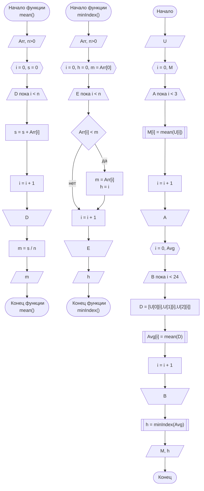

# Задание для зачёта по дисциплине «Стандарты и оформление инженерной документации»

Генерация PDF здесь https://www.overleaf.com/read/vzcwzwxksnkz (главное в меню выбрать компилятор XeLaTeX)

```mermaid
%%{ init: { 'flowchart': { 'curve': 'bump' } } }%%
flowchart TD
start1(["Начало функции<br>mean()"]) --> input1[/"#160;#160;Arr, n>0#160;#160;"/]
input1 --> i1{{i = 0, s = 0}}
i1 -->  startloop11[/D пока i < n\]
startloop11 --> solve11["s = s + Arr[i]"]
solve11 --> solve12[i = i + 1]
solve12 --> endloop11[\"#160;#160;#160;#160;#160;#160;#160;#160;D#160;#160;#160;#160;#160;#160;#160;#160;"/]
endloop11 --> solve13[m = s / n]
solve13 --> output1[/"#160;#160;#160;#160;#160;m#160;#160;#160;#160;#160;"/]
output1 -->  end1(["#160;Конец функции<br>mean()"])

start2(["Начало функции<br>minIndex()"]) --> input2[/"#160;#160;Arr, n>0#160;#160;"/]
input2 --> i2{{"i = 0, h = 0, m = Arr[0]"}}
i2 -->  startloop21[/E пока i < n\]
startloop21 --> if2{"Arr[i] < m"}
if2 --> |да| solve21["m = Arr[i]<br>h = i"]
if2 --> |нет| solve22
solve21 --> solve22[i = i + 1]
solve22 --> endloop21[\"#160;#160;#160;#160;#160;#160;#160;#160;E#160;#160;#160;#160;#160;#160;#160;#160;"/]
endloop21 --> output2[/"#160;#160;#160;#160;#160;h#160;#160;#160;#160;#160;"/]
output2 -->  end2(["#160;Конец функции<br>minIndex()"])

start([Начало]) --> input[/"#160;#160;#160;#160;#160;#160;#160;#160;U#160;#160;#160;#160;#160;#160;#160;#160;"/]
input --> i{{i = 0, M}}
i -->  startloop3[/A пока i < 3\]
startloop3 --> solve1[["M[i] = mean(U[i])"]]
solve1 --> solve2[i = i + 1]
solve2 --> endloop3[\"#160;#160;#160;#160;#160;#160;#160;#160;A#160;#160;#160;#160;#160;#160;#160;#160;"/]
endloop3 --> j{{i = 0, Avg}}
j --> startloop4[/B пока i < 24\]
startloop4 --> solve3["D = [U[0][i],U[1][i],U[2][i]]"]
solve3 --> solve4[["Avg[i] = mean(D)"]]
solve4 --> solve5[i = i + 1]
solve5 --> endloop4[\"#160;#160;#160;#160;#160;#160;#160;#160;B#160;#160;#160;#160;#160;#160;#160;#160;"/]
endloop4 --> solve6[["h = minIndex(Avg)"]]
solve6 --> output[/"#160;#160;#160;#160;#160;M, h#160;#160;#160;#160;#160;"/]
output -->  End(["#160;Конец#160;"])

%%classDef default fill:#fff,stroke:#000,stroke-width:2px;
%%linkStyle default stroke:#000,stroke-width:2px,color:black;
```
